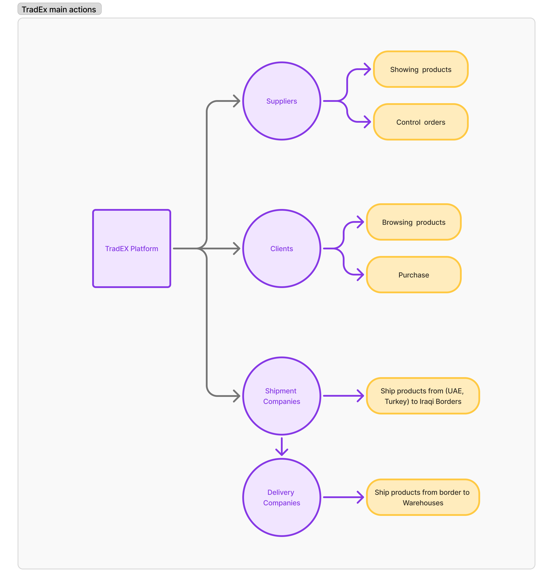
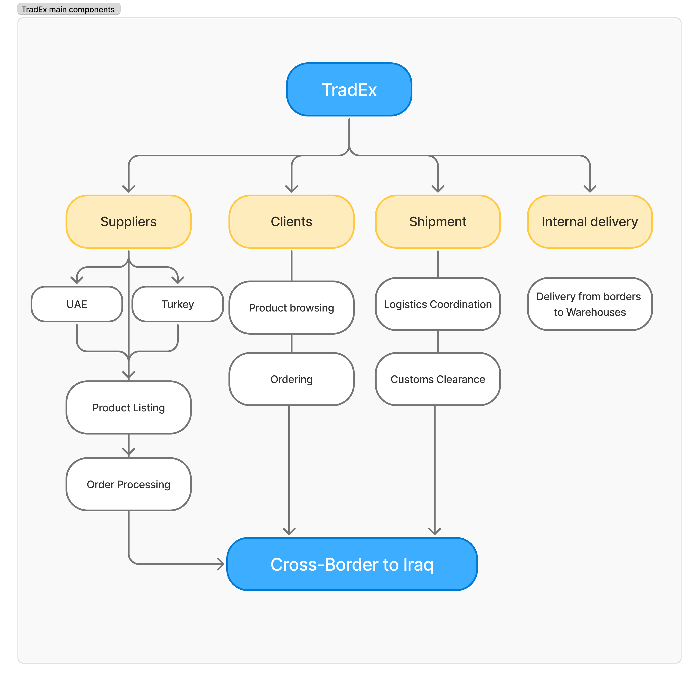
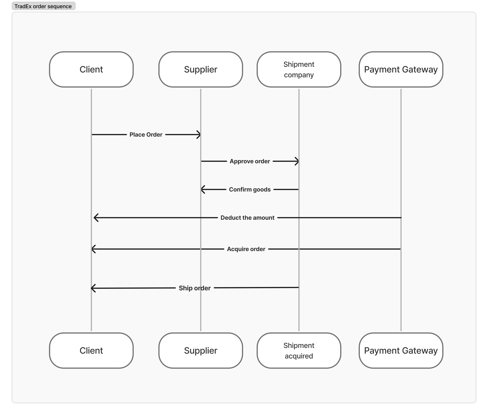
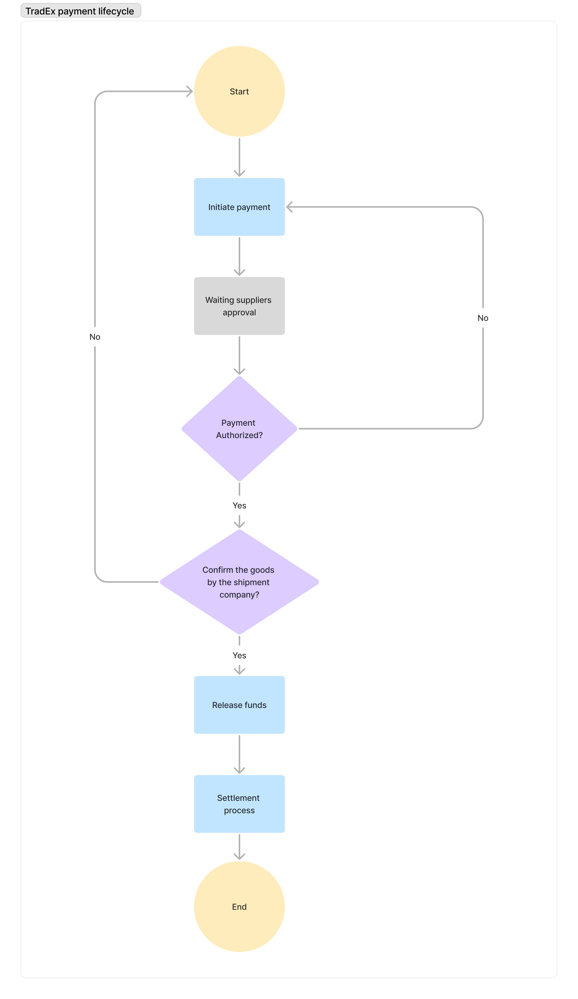

# TradEX Platform Overview

TradEX is a B2B e-commerce platform that connects Iraqi clients with international suppliers, primarily from UAE and Turkey. It facilitates product discovery, order placement, shipment logistics, and secure payment settlement. The platform streamlines cross-border trade by integrating clients, suppliers, and shipping partners into a unified digital ecosystem.

---

## 🧩 High-Level Platform Structure

### Key Entities:

* **Clients (Iraq)**: Search for products, place orders.
* **Suppliers (UAE & Turkey)**: Manage product listings, process orders.
* **Shipment Companies**: Handle logistics and confirm goods pickup.
* **TradEX Platform**: Connects all actors and processes.
* **Payment Gateway (e.g., TapPay)**: Handles payment authorization and fund settlement.

### Order Sequence:

1. **Client places an order**.
2. **Supplier reviews and approves the order**.
3. **Shipment company confirms pickup of goods**.
4. **Payment is initiated via TapPay**.
5. **Once authorized, payment is captured and funds released**.
6. **Confirmation sent to client; shipment proceeds to Iraq**.

---

## 📊 Platform Overview Diagram

The Platform Overview Diagram provides a simplified visual representation of the TradEX ecosystem. At its core is the TradEX platform, surrounded by suppliers from the UAE and Turkey, clients from Iraq, and shipment companies acting as a bridge between suppliers and clients. It illustrates the general flow of goods and services from international sources to Iraqi buyers and how TradEX orchestrates all the interactions.


---

## 🧬 Detailed Component Diagram

This diagram dives deeper into the operational structure of TradEX. It breaks down each major entity (Suppliers, Clients, Shipment Companies) and shows their internal functions and connections to the platform. For example, it showcases supplier operations like order handling and product listing, and highlights how shipment flows originate in UAE/Turkey and terminate in Iraq. This diagram helps stakeholders understand the specific responsibilities and relationships within the ecosystem.


---

## 🔁 Order Sequence Diagram

The Order Sequence Diagram outlines the end-to-end interaction flow between clients, suppliers, shipment companies, and the payment gateway. It begins with the client placing an order, continues through supplier approval and shipment confirmation, and culminates in payment execution and final shipping. This diagram helps clarify the dependencies and approval steps needed before a transaction completes.


---

## 🔄 Payment and Settlement Flow

The Payment and Settlement Flowchart illustrates the steps that occur after the shipment company confirms goods acquisition. It begins with initiating the payment request, checks for authorization via the gateway (e.g., TapPay), and leads to fund release and final settlement. This flow ensures the platform enforces trust by holding payments until shipment confirmation.

```plaintext
Start
  ↓
Confirm Pickup from Shipment Company
  ↓
Initiate Payment
  ↓
[ Payment Authorized? ]
   ↙ Yes           ↘ No
Confirm Payment     Payment Declined
  ↓
Release Funds
  ↓
Settlement
```


---

## 🧱 TradEX Software Components

### 1. TradEX Website (Client Portal)

* Product Search and Discovery
* Multi-language Support (Arabic/Kurdish/English)
* Product Listing by Supplier
* Cart Management
* Order Placement and History
* Shipment Tracking
* Payment Processing (TapPay Integration)

### 2. Supplier Dashboard

* Login and Authentication
* Product Management (Add/Edit/Remove)
* Inventory Tracking
* Order Management:

  * View Orders
  * Accept/Reject Orders
  * Update Status: "Ready for Pickup"
* Performance Metrics & Reports

### 3. Admin Dashboard

* User Management (Clients/Suppliers/Shipping Partners)
* Role-Based Access Control
* Product and Category Moderation
* Order Oversight
* Shipping and Customs Coordination
* Payment & Dispute Resolution Tools
* Analytics & Dashboard Insights

### 4. APIs

* **Authentication APIs**: JWT/OAuth-based access control
* **Order Management APIs**: Create, view, update order status
* **Product APIs**: CRUD operations for product catalog
* **Shipping APIs**: Sync logistics provider status and confirmation
* **Payment APIs**: Integration with TapPay
* **Notification APIs**: Email, SMS, and in-app alerts for real-time updates

---

## 🌍 Trade Route Focus

**Export Countries**:

* 🇦🇪 UAE (Suppliers)
* 🇹🇷 Turkey (Suppliers)

**Import Country**:

* 🇮🇶 Iraq (Clients)

Logistics are handled by verified third-party shipment companies that confirm pickup before triggering payments.

---

## 📦 Future Enhancements

* Automated Customs Clearance Module
* Supplier Performance Scoring
* Loyalty/Reward System for Clients
* Mobile Apps (iOS & Android)
* Integration with Iraq’s local banking network

---

For visual diagrams, refer to the linked diagrams:

- 

- 

- 

- 

